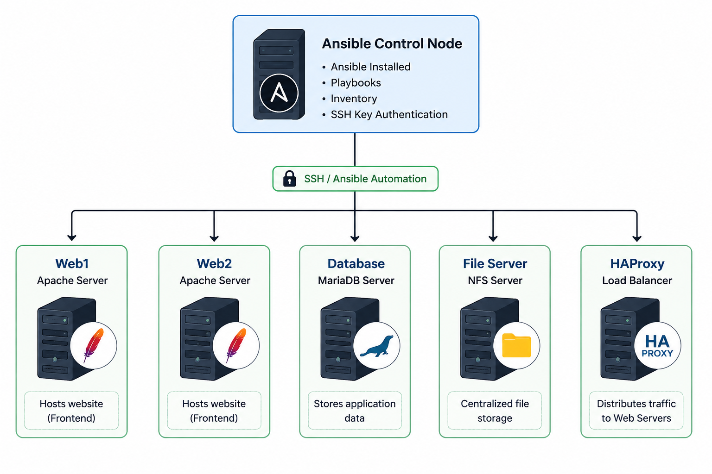
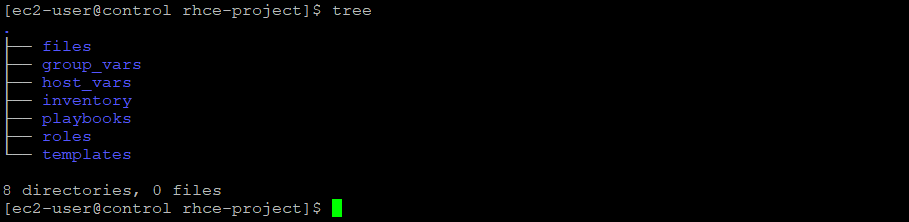
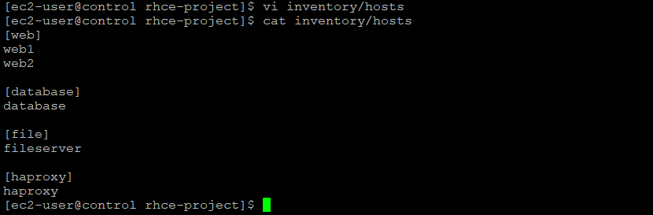
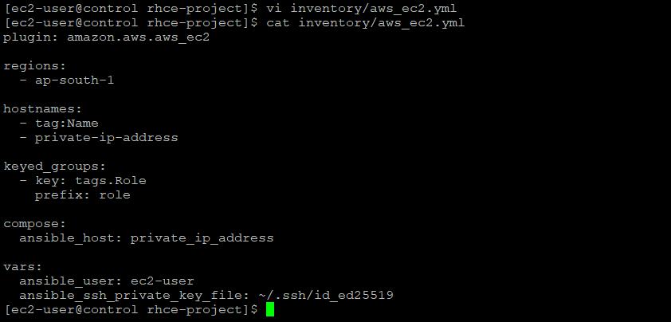
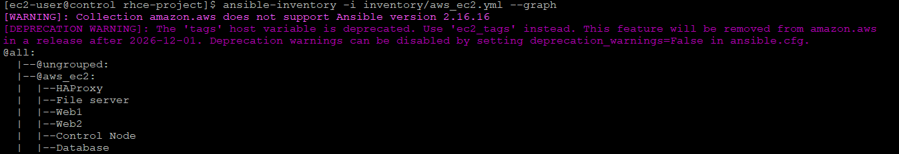
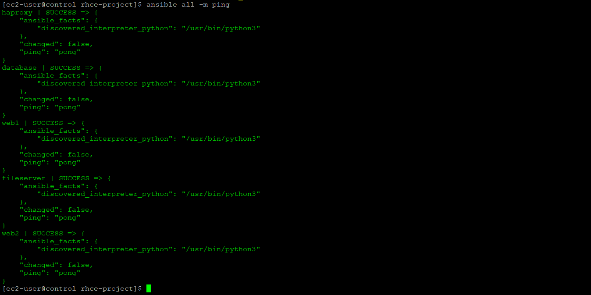
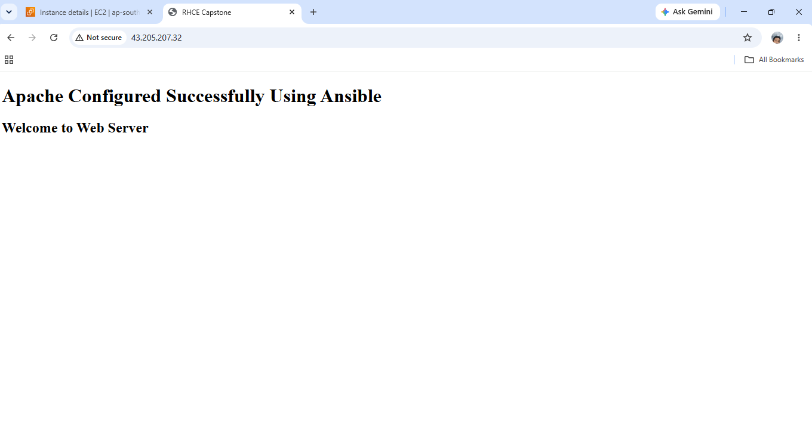
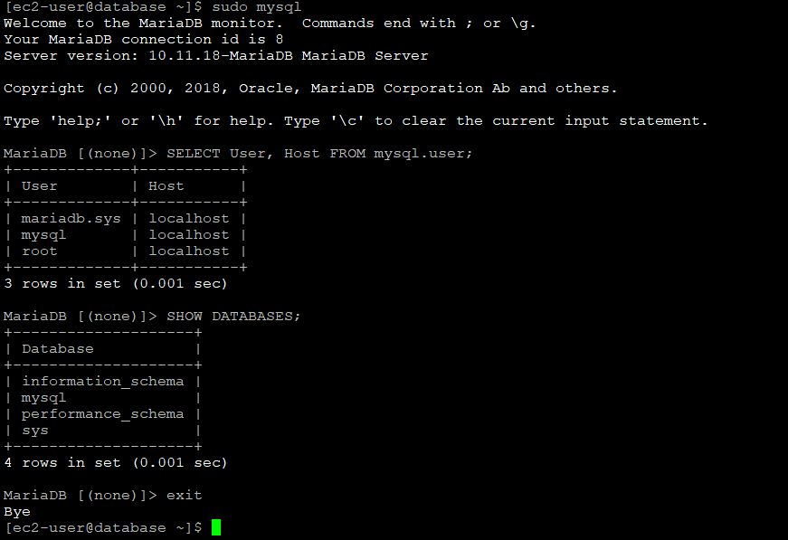
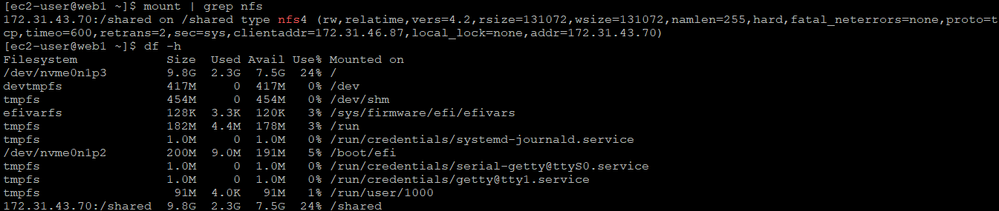

<div align="center">

# 🚀 RHCE Capstone Project
### Enterprise Linux Infrastructure Automation using Ansible


**Infrastructure Automation • Linux Administration • Configuration Management • DevOps**

</div>


# 📖 Project Overview

This RHCE Capstone Project demonstrates the automation of an enterprise Linux infrastructure using **Ansible**. The project provisions and configures multiple Linux servers through reusable Ansible roles and playbooks, enabling consistent deployment, centralized management, and reduced manual effort.

The infrastructure includes automated deployment of web, database, storage, load balancing, monitoring, centralized logging, security hardening, and backup services, following infrastructure automation best practices.


# 🏗️ Architecture Diagram





# ✨ Features

- ✅ Infrastructure Automation with Ansible
- ✅ User & SSH Key Management
- ✅ Static and Dynamic Inventory
- ✅ Apache Web Server Deployment
- ✅ MariaDB Database Configuration
- ✅ NFS Server & Client Setup
- ✅ HAProxy Load Balancer
- ✅ Prometheus Monitoring
- ✅ Grafana Dashboard
- ✅ Node Exporter Integration
- ✅ Centralized Logging (rsyslog)
- ✅ Firewalld & SELinux Configuration
- ✅ Automated Backup using Cron
- ✅ Modular Ansible Roles
- ✅ Infrastructure Verification


# 🛠️ Technologies Used

| Category | Technologies |
|----------|--------------|
| Operating System | Red Hat Enterprise Linux (RHEL) |
| Automation | Ansible |
| Web Server | Apache HTTP Server |
| Database | MariaDB |
| File Sharing | NFS |
| Load Balancer | HAProxy |
| Monitoring | Prometheus, Grafana, Node Exporter |
| Logging | rsyslog |
| Security | Firewalld, SELinux |
| Cloud Platform | AWS EC2 |
| Version Control | Git & GitHub |


# 📂 Repository Structure

```text
RHCE-Capstone/
│
├── docs/
│   └── RHCE-Capstone-Project-Documentation.pdf
│
├── playbooks/
│
├── roles/
│
├── inventory/
│
├── screenshots/
│
├── architecture/
│   └── architecture-diagram.png
│
└── README.md
```


# 🚀 Deployment Workflow

```text
Project Initialization
        │
        ▼
Inventory Configuration
        │
        ▼
Create Ansible Roles
        │
        ▼
Execute Playbooks
        │
        ▼
Configure Infrastructure
        │
        ▼
Verify Services
        │
        ▼
Monitoring & Logging
        │
        ▼
Backup Automation
```


## 📸 Project Screenshots

### 📁 Project Structure

```bash
tree
```



### 📂 Static Inventory

```bash
vi inventory/hosts
```



### ☁️ Dynamic Inventory

The AWS EC2 dynamic inventory plugin automatically discovers EC2 instances in the **ap-south-1** region and groups them for Ansible management.

```bash
vi inventory/aws_ec2.yml
```

#### AWS EC2 Dynamic Inventory Configuration



#### Dynamic Inventory Verification

```bash
ansible-inventory -i inventory/aws_ec2.yml --graph
```



### ✅ Ansible Ping

```bash
ansible all -m ping
```



### 🌐 Apache Deployment



### 🗄️ MariaDB Configuration



### 📂 NFS Configuration



### ⚖️ HAProxy Configuration


### 📊 Prometheus Dashboard


### 📈 Grafana Dashboard


### 📝 rsyslog Configuration


### 💾 Backup Automation


# 💼 Skills Demonstrated

- Infrastructure Automation
- Ansible Playbooks & Roles
- Linux System Administration
- Apache Web Server Administration
- MariaDB Administration
- NFS Configuration
- HAProxy Load Balancing
- Monitoring with Prometheus & Grafana
- Centralized Logging
- Firewalld & SELinux Management
- Backup Automation
- AWS EC2 Administration
- Git & GitHub


# 📚 Documentation

Complete implementation details, configuration steps, playbooks, screenshots, and verification are available in the project documentation.

```text
docs/
└── RHCE-Capstone-Project-Documentation.pdf
```

---

# 👨‍💻 Author

**Nandu Sivadas**

**Cloud & DevOps Enthusiast**

- 🌐 GitHub: https://github.com/nandusivadas
- 💼 LinkedIn: www.linkedin.com/in/nandu-sivadas98
---

<div align="center">


</div>
