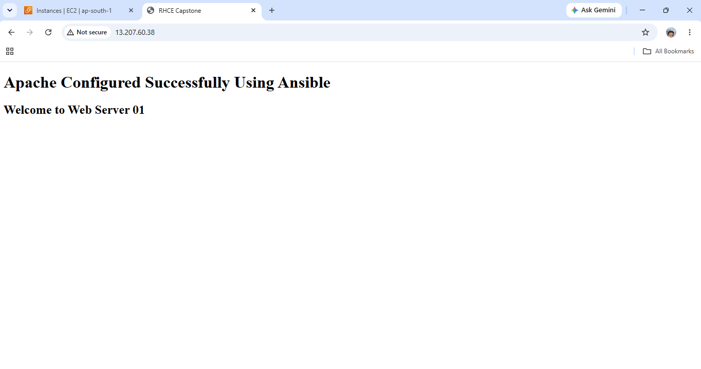
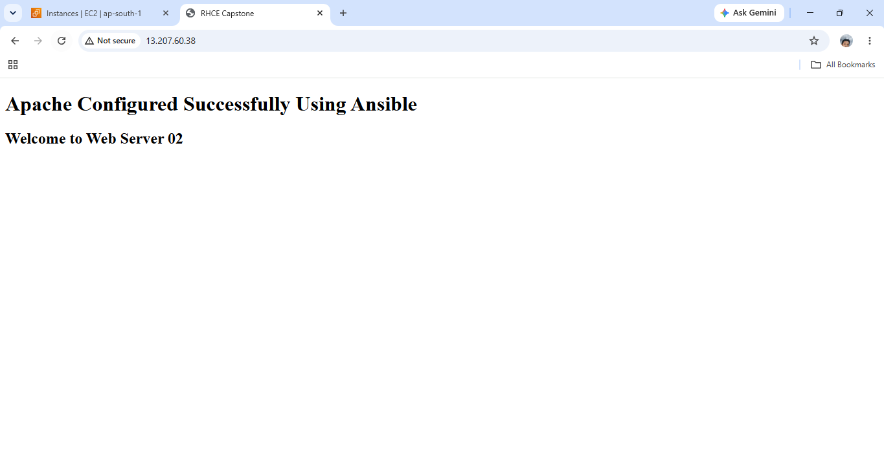
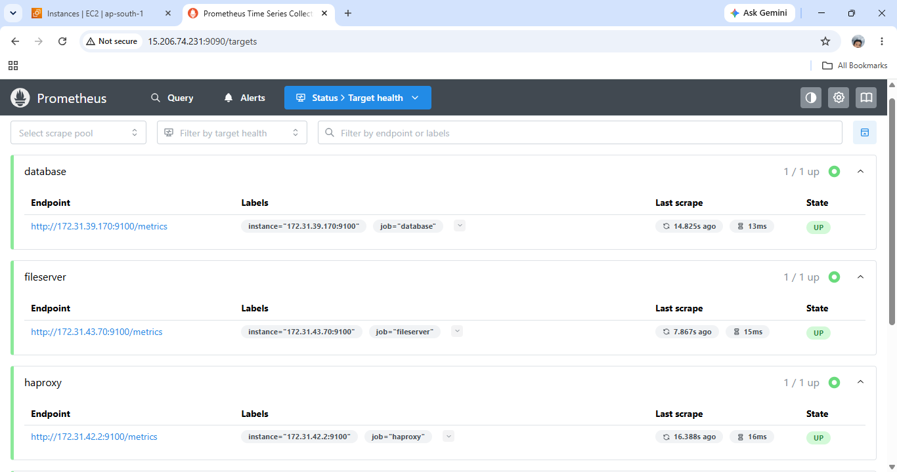
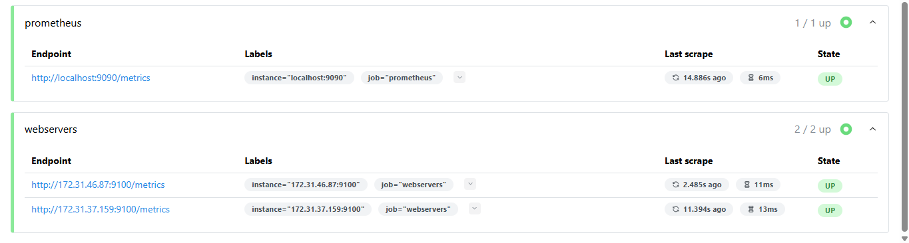
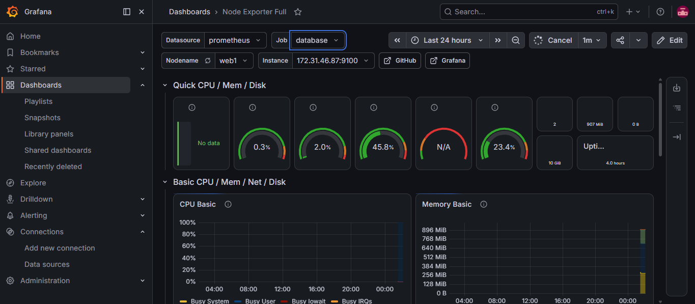
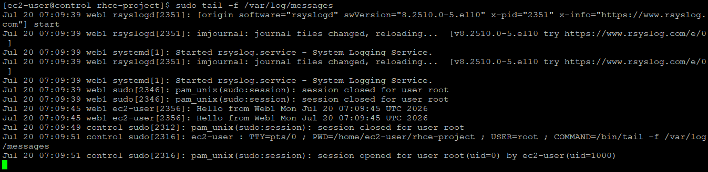
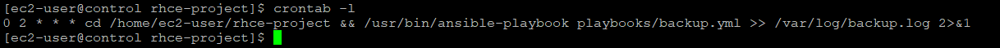
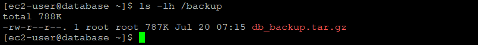

<div align="center">

# 🚀 RHCE Capstone Project
### Enterprise Linux Infrastructure Automation using Ansible


**Infrastructure Automation • Linux Administration • Configuration Management • DevOps**

</div>


# 📖 Project Overview

This RHCE Capstone Project demonstrates the automation of an enterprise Linux infrastructure using **Ansible**. The project provisions and configures multiple Linux servers through reusable Ansible roles and playbooks, enabling consistent deployment, centralized management, and reduced manual effort.

The infrastructure includes automated deployment of web, database, storage, load balancing, monitoring, centralized logging, security hardening, and backup services, following infrastructure automation best practices.


# 🏗️ Architecture Diagram


# ✨ Features

- ✅ Infrastructure Automation with Ansible
- ✅ User & SSH Key Management
- ✅ Static and Dynamic Inventory
- ✅ Apache Web Server Deployment
- ✅ MariaDB Database Configuration
- ✅ NFS Server & Client Setup
- ✅ HAProxy Load Balancer
- ✅ Prometheus Monitoring
- ✅ Grafana Dashboard
- ✅ Node Exporter Integration
- ✅ Centralized Logging (rsyslog)
- ✅ Firewalld & SELinux Configuration
- ✅ Automated Backup using Cron
- ✅ Modular Ansible Roles
- ✅ Infrastructure Verification


# 🛠️ Technologies Used

| Category | Technologies |
|----------|--------------|
| Operating System | Red Hat Enterprise Linux (RHEL) |
| Automation | Ansible |
| Web Server | Apache HTTP Server |
| Database | MariaDB |
| File Sharing | NFS |
| Load Balancer | HAProxy |
| Monitoring | Prometheus, Grafana, Node Exporter |
| Logging | rsyslog |
| Security | Firewalld, SELinux |
| Cloud Platform | AWS EC2 |
| Version Control | Git & GitHub |


# 📂 Repository Structure

```text
RHCE-Capstone/
│
├── docs/
│   └── RHCE-Capstone-Project-Documentation.pdf
│
├── playbooks/
│
├── roles/
│
├── inventory/
│
├── screenshots/
│
├── architecture/
│   └── architecture-diagram.png
│
└── README.md
```


# 🚀 Deployment Workflow

```text
Project Initialization
        │
        ▼
Inventory Configuration
        │
        ▼
Create Ansible Roles
        │
        ▼
Execute Playbooks
        │
        ▼
Configure Infrastructure
        │
        ▼
Verify Services
        │
        ▼
Monitoring & Logging
        │
        ▼
Backup Automation
```


## 📸 Project Screenshots

### 📁 Project Structure

The project follows a modular Ansible role-based structure, making automation tasks organized, reusable, and easy to maintain.

```bash
tree
```


---

### 📂 Static Inventory

The static inventory defines all managed nodes manually, grouping servers based on their roles for Ansible automation.

```bash
vi inventory/hosts
```


---

### ☁️ Dynamic Inventory

The AWS EC2 dynamic inventory plugin automatically discovers EC2 instances in the **ap-south-1** region and groups them for Ansible management.

```bash
vi inventory/aws_ec2.yml
```

#### AWS EC2 Dynamic Inventory Configuration


#### Dynamic Inventory Verification

```bash
ansible-inventory -i inventory/aws_ec2.yml --graph
```


---

### ✅ Ansible Ping

Ansible connectivity was verified by successfully communicating with all managed nodes using the built-in ping module.

```bash
ansible all -m ping
```


---

### 🌐 Apache Deployment

Apache HTTP Server was deployed and configured using Ansible. The browser output confirms that the web servers are accessible and serving web content successfully.


---

### 🗄️ MariaDB Configuration

MariaDB was installed and configured through Ansible. The following commands verify the database service, users, and available databases.

```bash
sudo mysql
```

```bash
SELECT User, Host FROM mysql.user;
```

```bash
SHOW DATABASES;
```


---

### 📂 NFS Configuration

Network File System (NFS) was configured to provide shared storage between servers. The mounted filesystem was verified successfully.

```bash
mount | grep nfs
```

```bash
df -h
```


---

### ⚖️ HAProxy Configuration

HAProxy was configured as a load balancer to distribute incoming requests across multiple backend web servers, ensuring high availability.





---

### 📊 Prometheus Dashboard

Prometheus was configured to collect system and application metrics from all managed nodes for centralized monitoring.





---

### 📈 Grafana Dashboard

Grafana was integrated with Prometheus to visualize collected metrics through interactive dashboards.



---

### 📝 rsyslog Configuration

Centralized logging was implemented using **rsyslog**. The control server successfully receives and stores log messages from managed client nodes in real time.

```bash
sudo tail -f /var/log/messages
```



---

### 💾 Backup Automation

Automated website and database backups were scheduled using a cron job. Backup archives were successfully created and stored in the backup directory.

```bash
crontab -l
```



```bash
ls -lh /backup
```


# 💼 Skills Demonstrated

- Infrastructure Automation
- Ansible Playbooks & Roles
- Linux System Administration
- Apache Web Server Administration
- MariaDB Administration
- NFS Configuration
- HAProxy Load Balancing
- Monitoring with Prometheus & Grafana
- Centralized Logging
- Firewalld & SELinux Management
- Backup Automation
- AWS EC2 Administration
- Git & GitHub


# 📚 Documentation

Complete implementation details, configuration steps, playbooks, screenshots, and verification are available in the project documentation.

```text
docs/
└── RHCE-Capstone-Project-Documentation.pdf
```

---

# 👨‍💻 Author

**Nandu Sivadas**

**Cloud & DevOps Enthusiast**

- 🌐 GitHub: https://github.com/nandusivadas
- 💼 LinkedIn: www.linkedin.com/in/nandu-sivadas98
---

<div align="center">


</div>
